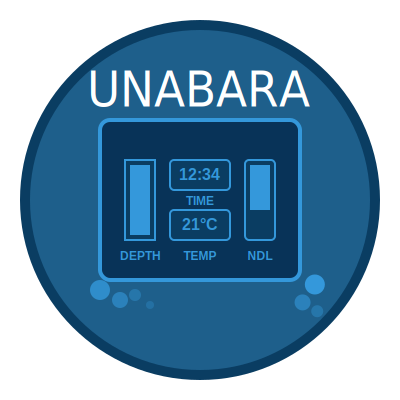

# Unabara

<p align="center">
  
</p>

Unabara is a powerful tool for creating telemetry overlays for scuba diving videos. It extracts data from dive logs and generates customizable overlays that can be composited with your diving footage.

## Features

- **Import Dive Logs**: Import Subsurface (XML/SSRF) and UDDF dive logs to extract comprehensive diving telemetry. Unabara supports most kinds of diving: from single tank recreational dives to multi-tanks technical dives in Open Circuit or Closed Circuit Rebreather.
- **Visual Timeline**: View and navigate your dive data on an interactive timeline.
- **Video Import**: Import your dive footage and position it against your dive data on the timeline.
- **Video Preview & Sync**: Play your footage directly in Unabara and align it with your dive graphically — the timeline cursor follows the video, so you can match the overlay to your dive computer frame by frame. Save per-camera sync profiles for repeatable alignment.
- **Customizable Overlay**: Configure which telemetry data appears in your overlay (depth, temperature, NDL, tank pressure, dive time, breathing gas, CNS, max/average depth, and CCR PO₂ cells), with optional per-cell or global labels.
- **Dive Profile Graph**: Generate a customizable depth-over-time dive profile that can be composited as its own overlay.
- **Template Selection**: Choose from built-in overlay templates or import your own designs.
- **Undo/Redo**: Full edit history in the template editor — step back and forward through your changes (Ctrl+Z / Ctrl+Y).
- **Export Options**:
  - Export as image sequence for video editing software
  - Export directly as video file in multiple codecs, including transparency-capable formats (ProRes 4444, VP9) for compositing (requires FFmpeg)

## Screenshots


## Documentation

The complete documentation is available on the [wiki](https://github.com/arnauddupuis/unabara/wiki).

To quickly be up and running have a look at the quick [start guide](https://github.com/arnauddupuis/unabara/wiki/quick-start-guide).

The complete changelog is available on the [release page](https://github.com/arnauddupuis/unabara/releases).


## Example

Here is a (low resolution) example of what you can generate with Unabara (open circuit, 4 tanks technical dive).

https://github.com/user-attachments/assets/ee493dfc-49ae-4302-8b2a-13acf3607847

And a higher resolution one (CCR technical dive):

https://github.com/user-attachments/assets/e921109f-2616-48b3-8ceb-769361843e74


## Requirements

- FFmpeg (optional, required for direct video export)

## Installation

Pre-built packages are available on the [Releases page](https://github.com/arnauddupuis/unabara/releases). Download the appropriate package for your operating system:

### Windows

1. Download `unabara-windows-x.x.x.zip`
2. Extract the archive to a folder of your choice
3. It is recommended to install FFmpeg from [FFmpeg website](https://ffmpeg.org/download.html) ([Direct download link](https://github.com/BtbN/FFmpeg-Builds/releases/download/latest/ffmpeg-master-latest-win64-gpl-shared.zip))
4. Alternatively you can use the [Chocolatey package manager](https://github.com/chocolatey/choco/releases) to install FFmpeg. Once Chocolatey is installed on your windows, open a command prompt as administrator and run: `choco install ffmpeg`
5. Run `unabara.exe`

### macOS

1. Download `unabara-macos-universal-x.x.x.dmg`
2. Open the DMG file
3. Drag the Unabara app to your Applications folder
4. It is recommended to install FFmpeg using [Homebrew](https://brew.sh/): `brew install ffmpeg`
5. Launch Unabara from Applications

### Linux (Flatpak)

1. Download `unabara-linux-x.x.x.flatpak`
2. Install the Flatpak package:
   ```bash
   flatpak install unabara-linux-x.x.x.flatpak
   ```
3. Launch Unabara from your application menu, or run:
   ```bash
   flatpak run org.unabara.unabara
   ```

## Building from Source

### Dependencies

- Qt 6.8.0 or newer (Core, Gui, Quick, Qml, Xml, Concurrent, Widgets, Network, Multimedia)
- CMake 3.16 or newer
- C++17 compatible compiler (GCC 9+, Clang 10+, MSVC 2019+)

### Linux

```bash
# Install dependencies (Ubuntu/Debian)
sudo apt install build-essential cmake qt6-base-dev qt6-declarative-dev libqt6xml6-dev qt6-multimedia-dev

# Install dependencies (Fedora)
sudo dnf install cmake gcc-c++ qt6-qtbase-devel qt6-qtdeclarative-devel qt6-qtbase-private-devel qt6-qtmultimedia-devel

# Install dependencies (Arch Linux)
sudo pacman -S cmake base-devel qt6-base qt6-declarative qt6-multimedia

# Clone the repository
git clone https://github.com/arnauddupuis/unabara.git
cd unabara

# Create build directory
mkdir build && cd build

# Configure and build
cmake ..
cmake --build .

# Run the application
./bin/unabara
```

### macOS

```bash
# Install dependencies with Homebrew
brew install qt6 cmake

# Clone the repository
git clone https://github.com/arnauddupuis/unabara.git
cd unabara

# Create build directory
mkdir build && cd build

# Configure and build
cmake .. -DQt6_DIR=$(brew --prefix qt6)/lib/cmake/Qt6
cmake --build .

# Run the application
./bin/unabara
```

### Windows

1. Install [Qt 6.8.0](https://www.qt.io/download) or newer
2. Install [CMake](https://cmake.org/download/)
3. Install [Visual Studio 2019](https://visualstudio.microsoft.com/downloads/) or newer with C++ desktop development workload

```powershell
# Clone the repository
git clone https://github.com/arnauddupuis/unabara.git
cd unabara

# Create build directory
mkdir build
cd build

# Configure and build
cmake .. -DCMAKE_PREFIX_PATH=C:\path\to\Qt\6.8.0\msvc2019_64
cmake --build . --config Release

# Run the application
.\bin\Release\unabara.exe
```

## Video Export

For direct video export functionality, FFmpeg needs to be installed on your system:

- **Linux**:
   - _Ubuntu/Debian_: `sudo apt install ffmpeg`
   - _Fedora_: `sudo dnf install ffmpeg`
   - _Arch Linux_: `sudo pacman -S ffmpeg`
- **macOS**: `brew install ffmpeg` ([Homebrew](https://brew.sh) needs to be installed on your mac beforehand)
- **Windows**: Download from [FFmpeg website](https://ffmpeg.org/download.html) ([Direct download link](https://github.com/BtbN/FFmpeg-Builds/releases/download/latest/ffmpeg-master-latest-win64-gpl-shared.zip)). It is recommended to install FFmpeg from [FFmpeg website](https://ffmpeg.org/download.html) ([Direct download link](https://github.com/BtbN/FFmpeg-Builds/releases/download/latest/ffmpeg-master-latest-win64-gpl-shared.zip)). Alternatively you can use the [Chocolatey package manager](https://github.com/chocolatey/choco/releases) to install FFmpeg. Once Chocolatey is installed on your windows, open a command prompt as administrator and run: `choco install ffmpeg`

## Usage

1. Launch Unabara
2. Import a dive log file (Subsurface XML/SSRF or UDDF format)
3. Optionally import your dive video footage
4. Adjust the positioning and video sync timing using the timeline
5. Configure the overlay display options in settings
6. Export as image sequence or video file

Then you can use the generated video or image sequence as a telemetry overlay in your video editor software.

## License

Unabara is licensed under the GNU General Public License v2.0.

## Name Origin

"Unabara" (海原) is a Japanese word meaning "the ocean" or "the great expanse of the sea."